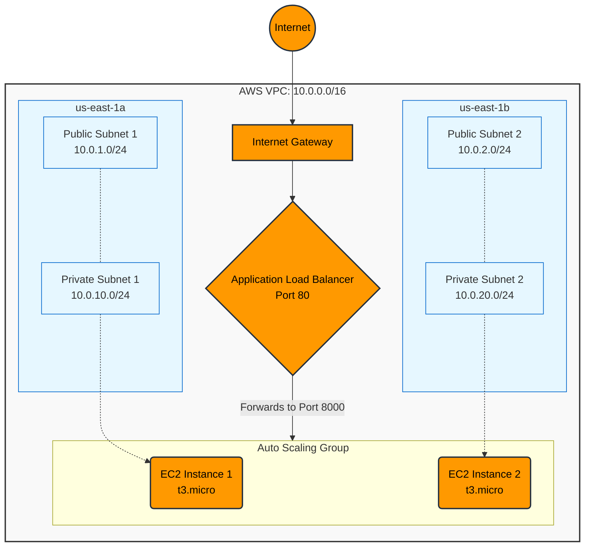

# Highly Available 2-Tier AWS Architecture via Terraform

## 📌 Project Overview
This project transitions manual AWS Cloud infrastructure provisioning ("ClickOps") into a fully automated, version-controlled **Infrastructure as Code (IaC)** pipeline using **Terraform**. 

The code deploys a highly available, scalable 2-tier web application architecture distributed across multiple Availability Zones to ensure fault tolerance and secure traffic routing.

## 🏗️ Architecture Design
*   **Virtual Private Cloud (VPC):** Custom isolated network environment.
*   **High Availability:** 4 Subnets (2 Public, 2 Private) distributed across `us-east-1a` and `us-east-1b`.
*   **Internet Gateway & Route Tables:** Configured to manage inbound/outbound internet traffic routing.
*   **Security Group Chaining:** Strict firewall rules where the Web Server security group only accepts traffic originating directly from the Load Balancer, blocking all direct internet access.
*   **Application Load Balancer (ALB):** Distributes incoming HTTP web traffic across multiple instances in different Availability Zones.
*   **Auto Scaling Group (ASG) & Launch Template:** Automatically provisions and manages `t3.micro` EC2 instances (running a Python HTTP server) based on demand and health checks.



*   **Virtual Private Cloud (VPC):** Custom isolated network environment.
*   **High Availability:** 4 Subnets (2 Public, 2 Private) distributed across `us-east-1a` and `us-east-1b`.

## 🛠️ Technologies Used
*   **Cloud Provider:** Amazon Web Services (AWS)
*   **Infrastructure as Code:** Terraform (v1.15.8)
*   **Compute & Networking:** EC2, VPC, ALB, ASG, Security Groups
*   **Command Line Interfaces:** AWS CLI, WSL (Ubuntu)

## 🚀 Key Learnings & Skills Demonstrated
*   **Infrastructure Automation:** Completely eliminated manual cloud configuration.
*   **Security Best Practices:** Implemented least-privilege access using private subnets and Security Group chaining.
*   **Disaster Recovery & Fault Tolerance:** Leveraged multiple Availability Zones so the application remains online even if a data center goes down.
*   **Debugging & Troubleshooting:** Resolved port mismatch issues between ALB listeners and target groups, and navigated AWS free-tier instance limitations (transitioning from `t2.micro` to `t3.micro`).

## ⚙️ How to Deploy
1. Clone the repository.
2. Ensure AWS CLI is configured with valid credentials (`aws configure`).
3. Initialize the working directory:
   ```bash
   terraform init
